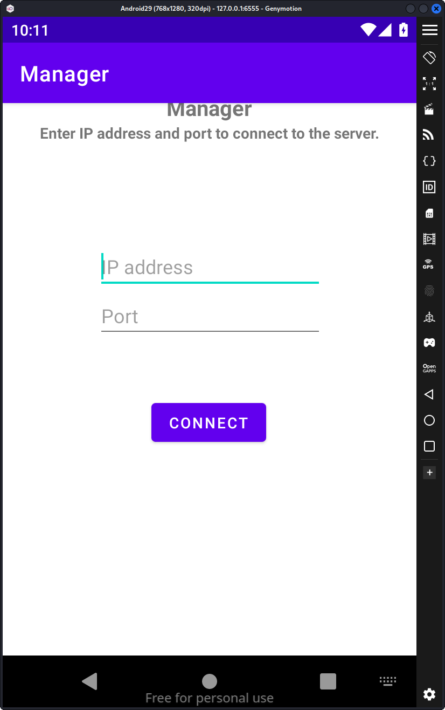
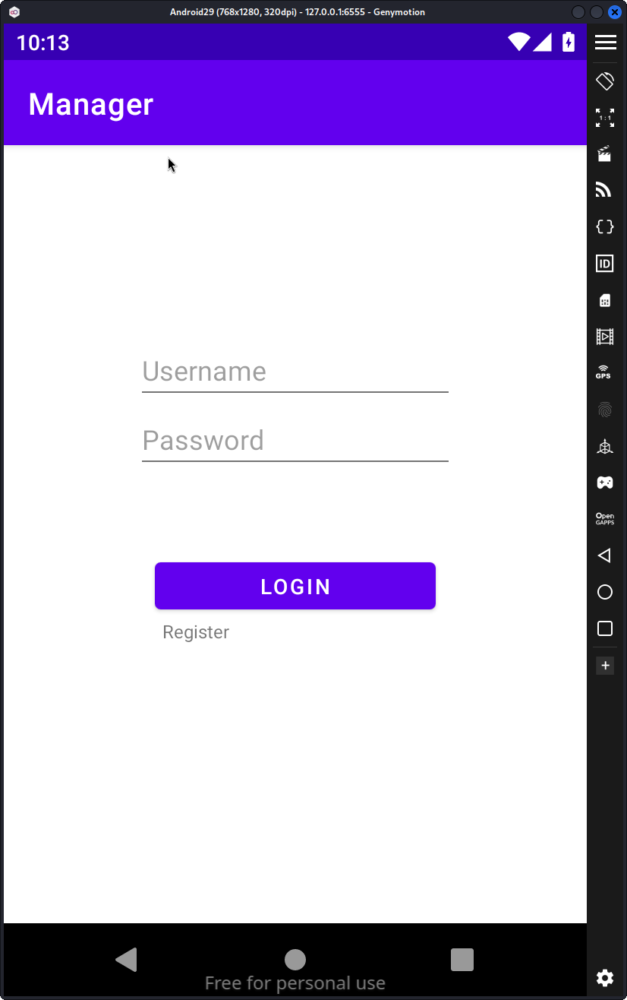
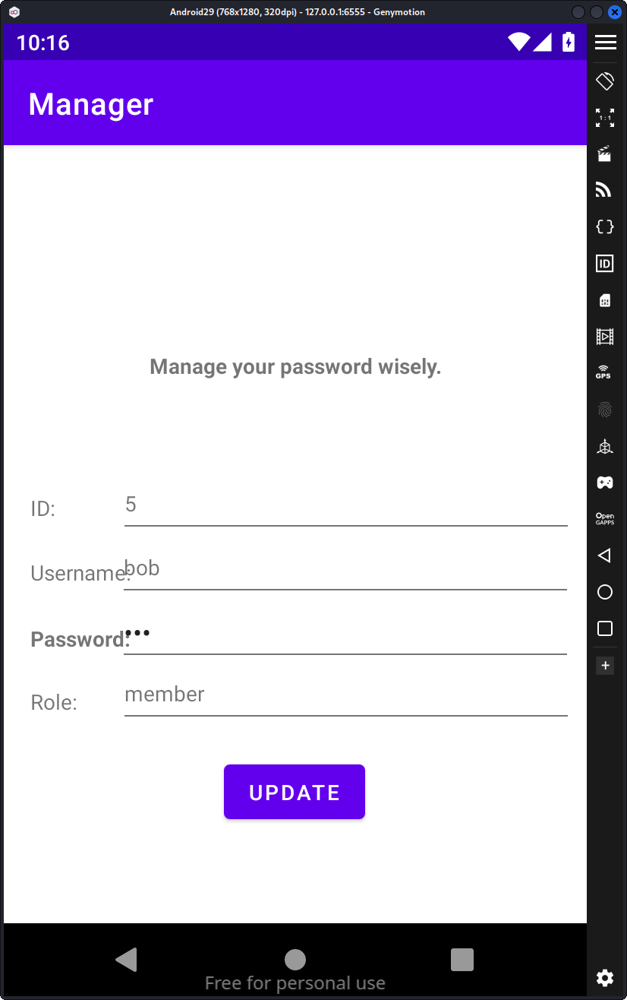
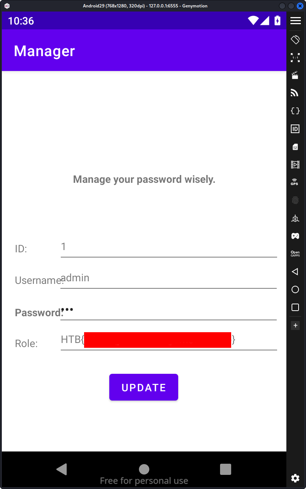

# HTB - Manager Mobile Challenge

This is a walkthrough of the Manager mobile app challenge on Hack The Box

## Tool Used

- JADX
- GenyMotion Android Emulator

## Analysis

First thing that stands out is that for this mobile challenge there's an instance that can be run
along side the app itself. This suggests the flag will not be in the app code itself, but a
vulnerability for the service the app is connected to within the client code in the app.

First we can get an idea of how the app works before digging into the code. Installing the app in
an emulator, we are greeted with a simple IP/Port input Activity:



Starting an instance on Hack the Box for the MManager challenge and typing in the info we move
to a login screen with a registration link:



From there we can try basic usernames and passwords, but given this challenge is a mobile app
challenge, it's unlikely a simple username and password attack is the intent of the challenge. We
can then register an account which immediately takes us to an activity where we can see our user
id, role and can change our password.



This is a potential viable vector because it's one instance where we can change the state of the
user resources on the remote system. Opening up the apk in jadx, we can see how the post request
is structured to change a user's password:

```java
HttpURLConnection httpURLConnection = (HttpURLConnection) new URL(str).openConnection();
httpURLConnection.setRequestMethod("POST");
httpURLConnection.setRequestProperty("User-Agent", "Mozilla/5.0");
httpURLConnection.setRequestProperty("Accept-Language", "en-US,en;q=0.5");
String str2 = "username=" + this.tvUsername.getText().toString() + "&password=" + this.etPassword.getText().toString();
httpURLConnection.setDoOutput(true);
```

It should be noted that at no point is a session token or existing password required, which suggests the server is only
looking at the username and updating the password for that username. There's no field for us to change the username but
we may be able to use a duplicate key exploit to change the password for another user with a higher role. It's also
worth noting that the post-body is url encoded and generated directly from strings pulled from the user interface
without any sanitization.

## Getting the Flag

This is the format that the post body looks like when using the password change field normally:

```
username=bob&password=bob
```

Here's a duplicate key attack payload that will attempt to change the admin's password to `bob`:

```
username=bob&password=bob&username=admin
```

In theory the post body is parsed left to right and the second appearance of username will overwrite the value of the
first instance. Since the code generates a portion of the post body the main thing that we need to provide is the
password payload which will look like this:

```
bob&username=admin
```

After entering that for our password and clicking update, we can go back to the login and enter in username and password
combination admin/bob. The login succeeds and the flag is displayed:



## Discussion

There are three main vulnerabilities at play.

The first, enumerated under MITRE's Common Weaknesses Enumeration (CWE) as
CWE-20, is improper input sanitization. At no point should direct user input be used to create a query to another
service such as a SQL database, REST api, or other services.

The second, enumerated under CWE-426, is duplicate keys in
associative lists. Because there's no standard in the url encoding specification for how to handle duplicate keys, the
behavior is unknown and often library dependent. For example some performance focused libraries may retrieve the first
instance of a key and it's value and not do further parsing. More commonly, the entire associative list is parsed before
returning the value for the key, and if duplicate keys are present, the old value is discarded for the new value. This
not only affects url encoded strings but also other popular markup languages like json. In 2017, Apache CloudDB had a
critical vulnerability (CVSS score of 9.8/10) where the use of Erlang and Javascript based json parsers conflicted to
the effect the first 'role' key was used for authentication but the second 'role' key was used to determine what a user
could do for different resources. This allowed non-privileged users to, for example, get write access to resources they
only had read access, or no access to at all.

Finally, the last vulnerability, enumerated under CWE-620, is Unverified Password Change. Allowing a user to change
authentication credentials without proving they are the user making the credential change request is a fundamental
vulnerability that should not be allowed in any modern service.

Key takeaways are when having users change credentials, make sure it's them, sanitize their input, and be mindful of
potential interactions with data encoding strategies that may have duplicate key vulnerabilities.


[1] https://cwe.mitre.org/data/definitions/20.html

[2] https://cwe.mitre.org/data/definitions/462.html

[3] https://nvd.nist.gov/vuln/detail/CVE-2017-12635

[4] https://cwe.mitre.org/data/definitions/620.html
